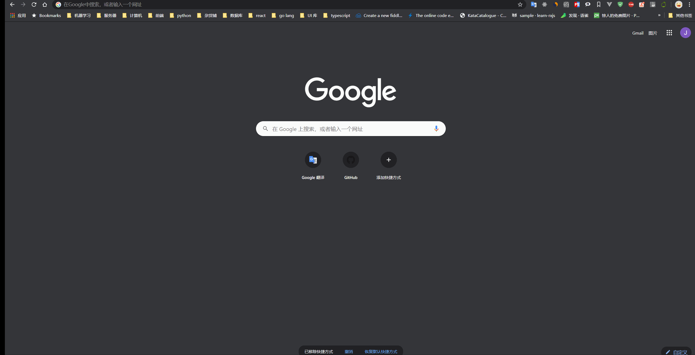
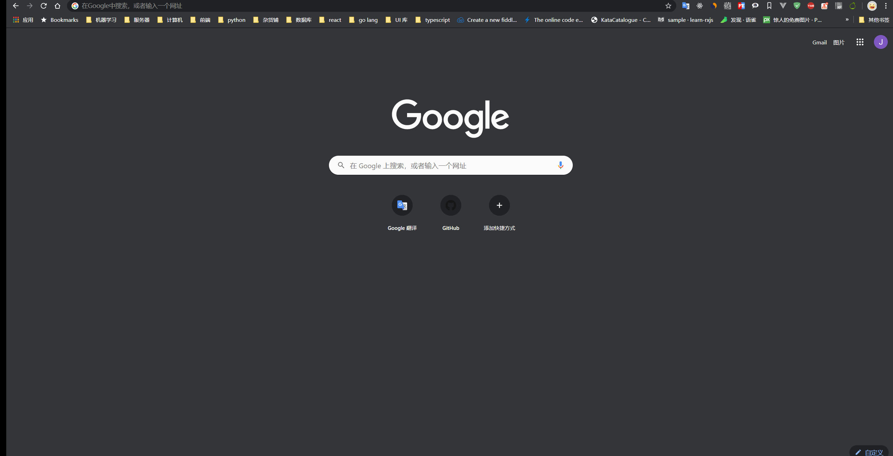

## 演示

浏览器在线浏览编辑 office 在办公类系统中是很常见的需求. office online server 是一个很好的解决方案.
部署 OOS 服务, 需要两台 Windows 服务器. 一台 **域控服务器**, 一台 **OOS服务器**.

域控服务器安装教程: https://blog.csdn.net/jiaqu2177/article/details/81943615  
OOS 服务器安装教程: https://blog.csdn.net/jiaqu2177/article/details/81945692  

准备好两台服务器后, 还需要实现一套 [wopi 接口](http://blogs.msdn.com/b/officedevdocs/archive/2013/03/21/introducing-wopi.aspx).

`/wopi/files/:name` 是获取文件信息的接口, 接口文档:  
https://docs.microsoft.com/en-us/openspecs/office_protocols/ms-wopi/9e351794-eee8-4fd1-b34c-0fec0ddeb20b

`/wopi/files/:name/contents` 返回文件流的接口:  
https://docs.microsoft.com/en-us/openspecs/office_protocols/ms-wopi/c7cb88c2-834b-4151-b423-d27a237b570f

浏览的话, 只需要实现这俩接口即可.

